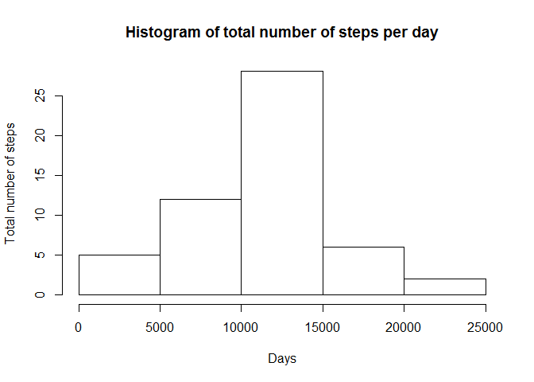
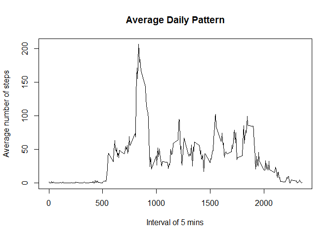
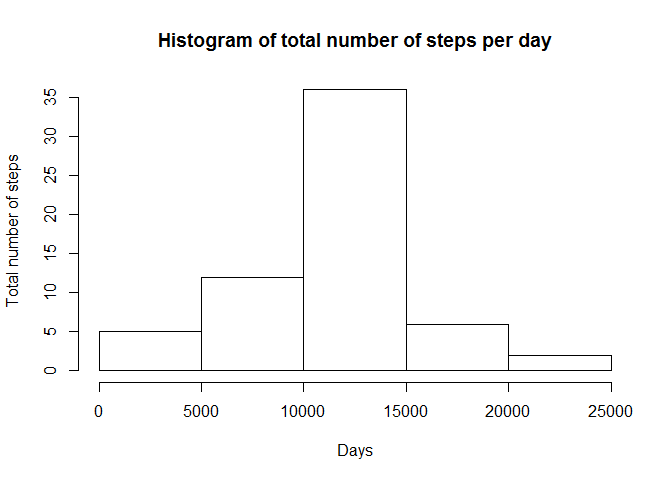
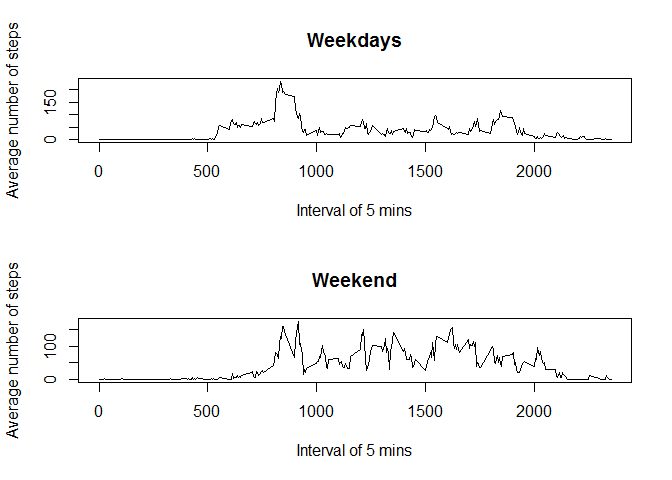

# Reproducible Research: Peer Assessment 1
##Loading and preprocessing the data

Show any code that is needed to

1. Load the data (i.e. read.csv())

```r
raw = read.csv(unz("activity.zip", "activity.csv"))
```

2. Process/transform the data (if necessary) into a format suitable for your analysis

- No other format done for now...
- Create new data.frame upon necessary


```r
head(raw)
```

```
##   steps       date interval
## 1    NA 2012-10-01        0
## 2    NA 2012-10-01        5
## 3    NA 2012-10-01       10
## 4    NA 2012-10-01       15
## 5    NA 2012-10-01       20
## 6    NA 2012-10-01       25
```


##What is mean total number of steps taken per day?

For this part of the assignment, you can ignore the missing values in the dataset.

1. Make a histogram of the total number of steps taken each day

```r
byDay = aggregate(steps~date, data=raw, FUN=sum)
hist(byDay$steps, 
     main="Histogram of total number of steps per day",
     xlab="Days",
     ylab="Total number of steps")
```

 

2. Calculate and report the mean and median total number of steps taken per day

```r
summary(byDay)[c(3:4), 2]
```

```
##                                     
## "Median :10765  " "Mean   :10766  "
```

##What is the average daily activity pattern?

1. Make a time series plot (i.e. type = "l") of the 5-minute interval (x-axis) and the average number of steps taken, averaged across all days (y-axis)

```r
par(mfrow = c(1, 1))
byInterval = aggregate(steps~interval, data=raw, FUN=mean)
plot(byInterval, 
     type="l", 
     main="Average Daily Pattern", 
     xlab="Interval of 5 mins", 
     ylab="Average number of steps")
```

 

2. Which 5-minute interval, on average across all the days in the dataset, contains the maximum number of steps?

```r
byInterval[byInterval$steps == max(byInterval$steps), "interval"]
```

```
## [1] 835
```

##Imputing missing values

Note that there are a number of days/intervals where there are missing values (coded as NA). The presence of missing days may introduce bias into some calculations or summaries of the data.

1. Calculate and report the total number of missing values in the dataset (i.e. the total number of rows with NAs)

```r
sum(is.na(raw$steps))
```

```
## [1] 2304
```

2. Devise a strategy for filling in all of the missing values in the dataset. The strategy does not need to be sophisticated. For example, you could use the mean/median for that day, or the mean for that 5-minute interval, etc.

- Decided to replace NAs with the average number of steps for that 5-minute interval.

3. Create a new dataset that is equal to the original dataset but with the missing data filled in.


```r
#copy raw data to new data
NAHandled = raw

#for each row
for(i in 1:nrow(NAHandled)){
    #if "steps" column is NA
    if(is.na(NAHandled[i, "steps"]))
        #replace the NA value with average number of steps for that specific interval
        NAHandled[i, "steps"] = byInterval[byInterval$interval == NAHandled[i, "interval"], "steps"]
}

#create a new data.frame
byDayWONA = aggregate(steps~date, data=NAHandled, FUN=sum)
```

4. Make a histogram of the total number of steps taken each day and Calculate and report the mean and median total number of steps taken per day. Do these values differ from the estimates from the first part of the assignment? What is the impact of imputing missing data on the estimates of the total daily number of steps?

```r
#draw histogram
hist(byDayWONA$steps, 
     main="Histogram of total number of steps per day",
     xlab="Days",
     ylab="Total number of steps")
```

 

```r
summary(byDayWONA)[c(3:4), 2]
```

```
##                                     
## "Median :10766  " "Mean   :10766  "
```

##Are there differences in activity patterns between weekdays and weekends?

For this part the weekdays() function may be of some help here. Use the dataset with the filled-in missing values for this part.

1. Create a new factor variable in the dataset with two levels ?€? ?€쐗eekday?€? and ?€쐗eekend?€? indicating whether a given date is a weekday or weekend day.

```r
#Set locale to match any testing environment
Sys.setlocale("LC_TIME", "C")
```

```
## [1] "C"
```

```r
#Create character variable names "weekdays"
raw$weekdays = weekdays(as.Date(raw$date))
#Create boolean variable names "isWeekend"
raw$isWeekend = raw$weekdays %in% c('Saturday','Sunday')

#replace weekdays column so it has two levels - "weekdays", "weekend"
for(i in 1:nrow(raw)){
    if(raw[i, "isWeekend"])
        raw[i, "weekdays"] = "weekdays"
    else
        raw[i, "weekdays"] = "weekend"
}
```

2. Make a panel plot containing a time series plot (i.e. type = "l") of the 5-minute interval (x-axis) and the average number of steps taken, averaged across all weekday days or weekend days (y-axis). See the README file in the GitHub repository to see an example of what this plot should look like using simulated data.


```r
#split raw into two separate data frames called weekend and weekday
weekdaysAverageByInterval = aggregate(steps~interval, data = raw[!raw$isWeekend, ], FUN = mean)
weekendAverageByInterval = aggregate(steps~interval, data = raw[raw$isWeekend, ], FUN = mean)

par(mfrow=c(2,1))
plot(weekdaysAverageByInterval, type="l", 
     main = "Weekdays", 
     xlab="Interval of 5 mins", 
     ylab="Average number of steps")
plot(weekendAverageByInterval, type="l", 
     main = "Weekend", 
     xlab="Interval of 5 mins", 
     ylab = "Average number of steps")
```

 

